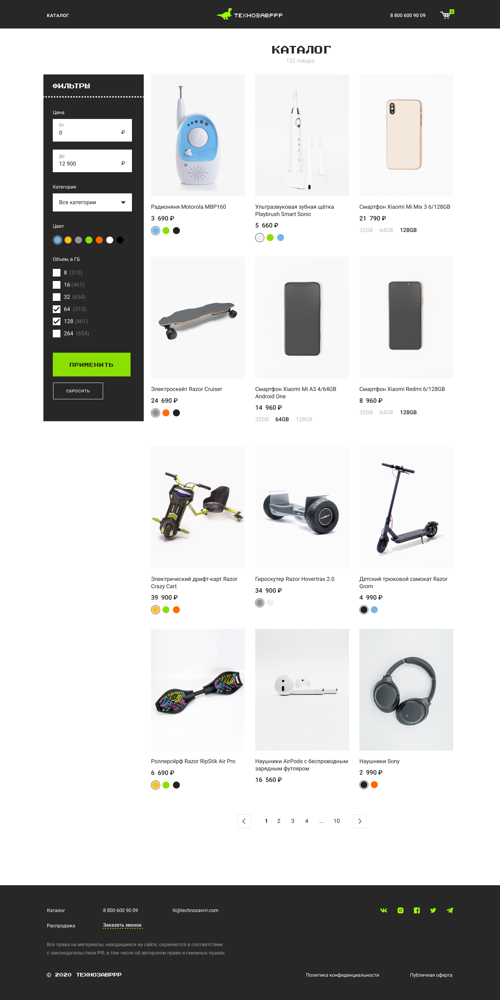

# Интернет-магазин "Технозавррр" на VueJS
___
[](https://wakatime.com/badge/user/387a55ad-b952-4b4b-a858-04fb88e1e94c/project/b343fc64-3acd-4e38-8b71-153551a36ae3)
[](https://wakatime.com/badge/user/387a55ad-b952-4b4b-a858-04fb88e1e94c/project/db26efea-beda-47ae-a7ab-6d9396dc66bd)

- API для получения неполных [данных](https://vue-study.skillbox.ru/#/)
- API для получения полных [данных](https://vue-tzr.skillbox.cc/#/)


___


## Project setup
```
npm install
```

### Compiles and hot-reloads for development
```
npm run serve
```

### Compiles and minifies for production
```
npm run build
```

### Lints and fixes files
```
npm run lint
```

### Customize configuration
See [Configuration Reference](https://cli.vuejs.org/config/).
